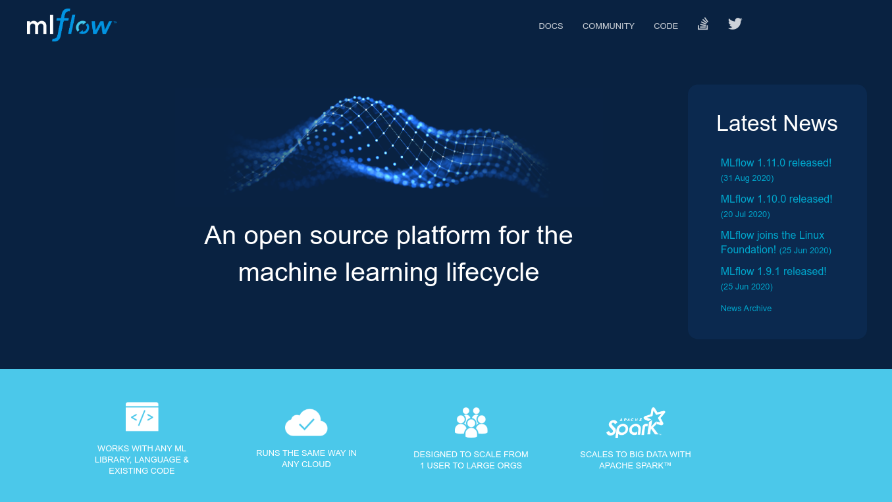
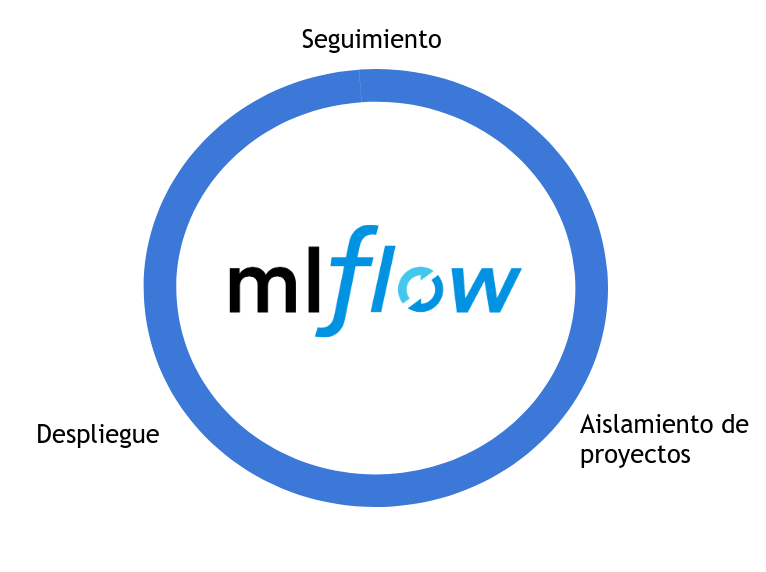

```{r setup, include=FALSE}
options(htmltools.dir.version = FALSE)
```

```{r xaringan-themer, include=FALSE, warning=FALSE}
library(xaringanthemer)

style_mono_accent(
  base_color = "#23395b",
  header_font_google = google_font("Josefin Sans"),
  text_font_google   = google_font("Montserrat", "300", "300i"),
  code_font_google   = google_font("Fira Mono")
)
```

```{r xaringan-logo, echo=FALSE}
xaringanExtra::use_logo(
  image_url = "img/logo-rcanarias.jpg"
)
```

<style>
.center2 {
  margin: 0;
  position: absolute;
  top: 50%;
  left: 50%;
  -ms-transform: translate(-50%, -50%);
  transform: translate(-50%, -50%);
}
</style>
 
# Sobre mí `r icon::fa("smile-wink")`

--

- Grado en Economía (ULPGC, 2015)


- Máster en Estadística e Investigación Operativa (UPC, 2017).


- Trabajando como data scientist desde 2017, actualmente en Ryanair `r icon::fa("plane-departure")`


- Puedes seguirme en [Github](https://github.com/jlopezper) [`r icon::fa("github")`](https://github.com/jlopezper), [Twitter](https://twitter.com/jlopezper) [`r icon::fa("twitter")`](https://twitter.com/jlopezper) o [Linkedin](https://www.linkedin.com/in/jlopezper/) [`r icon::fa("linkedin")`](https://www.linkedin.com/in/jlopezper/) 

```{r, echo=FALSE, out.width="30%", fig.align='center'}

```

---

# ¿Qué es?




---
class: center, middle




---

class: inverse, center, middle

# DEMO

---

class: center, middle

# ¡Gracias!

Enlace a presentación y código.

---
